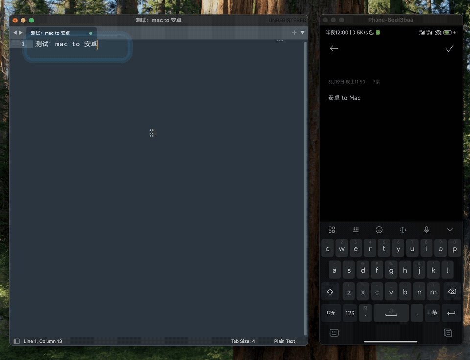
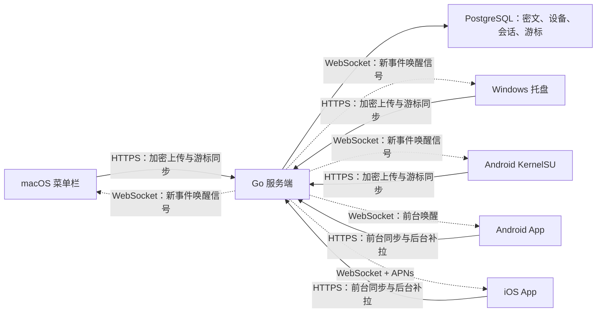

# 粘贴板助手

一个自托管、端到端加密的跨设备文本剪贴板同步工具。

在一台设备上复制文本后，粘贴板助手会在本地加密内容，经服务端通知其他在线设备更新剪贴板。服务端只保存密文、设备信息和同步游标，无法读取剪贴板明文。

当前仓库已实现 Go 服务端、macOS 菜单栏客户端、Windows 托盘客户端、普通 Android 客户端、iOS 客户端，以及适用于已 Root Android 设备的 KernelSU 模块。

## 双向同步演示

macOS 复制后，Android 会自动接收并在搜狗输入法中显示；Android 复制新内容后，也可以直接在 macOS 中粘贴。

<p align="center">
  
</p>

## 当前状态

| 组件 | 状态 | 运行环境 | 当前版本 |
| --- | --- | --- | --- |
| 服务端 | 可用 | Linux / Docker，Go 1.25，PostgreSQL 17 | 协议 v1 |
| macOS | 可用 | macOS 13 及以上 | 0.2.6 |
| Windows | 可用 | Windows 10 / 11，x64 或 ARM64 | 0.1.2 |
| Android | 可用 | Android 10 及以上 | 0.1.1 |
| Android KernelSU | 可用 | arm64、Android 10 及以上、KernelSU | 0.3.5 |
| iOS | 可用 | iOS 17 及以上，APNs | 0.1.0 |
| Linux 桌面端 | 尚未实现 | 服务端协议已预留 `linux` 平台类型 | - |

Android KernelSU 模块目前已在 MIUI Android 13、KernelSU 0.9.5 上进行过真机验证。Android 10 至 Android 16 的其他 AOSP 衍生系统属于预期兼容范围，仍需根据具体 ROM 实测。

## 主要能力

- 统一的“登录或注册”流程：账号不存在时自动注册，存在时直接登录。
- 账号不要求是邮箱，可使用 1 至 128 个非控制字符；账号区分大小写。
- 客户端使用 AES-256-GCM 加密剪贴板文本，服务端不接触明文和共享密钥。
- WebSocket 实时通知与 REST 游标补偿结合，断线重连后不会只依赖瞬时消息。
- 上传前持久化密文队列，网络恢复后自动重试。
- 使用设备 ID 与客户端事件 ID 实现 POST 幂等，超时重试不会重复创建事件。
- 维护历史设备、登录状态和在线状态，并以超级管理员、管理员和普通设备三级权限控制设备下线。
- 过滤刚刚同步回本机的内容，避免多台设备之间形成复制回环。
- 当前只同步纯文本，不同步图片、文件、富文本和剪贴板历史。

## 工作方式



一次本地复制会经过以下步骤：

1. 客户端检测到文本剪贴板变化，并与最近一次内容比较。
2. 客户端生成随机 `client_event_id` 和 12 字节随机 nonce。
3. 客户端以本地派生的 256 位密钥进行 AES-GCM 加密。
4. 完整的加密请求先写入本机待发送队列，再通过 `POST /v1/clips` 上传。
5. 服务端保存密文，按 `(origin_device_id, client_event_id)` 保证幂等，并通过 WebSocket 通知在线设备、通过 APNs 唤醒 iOS 设备。
6. 接收端使用已持久化的 `after_seq` 游标调用 REST 接口拉取事件，在本地解密后写入系统剪贴板。
7. 接收端确认新的序号。WebSocket 丢失或网络中断时，下次游标同步仍能补回遗漏事件。

WebSocket 在这里是低延迟的“叫醒信号”，PostgreSQL 中的事件序列和客户端游标才是可靠同步依据。

## 安全模型

### 端到端加密

登录成功后，各客户端使用服务端返回的规范账号和用户输入的密码，在本地派生相同的剪贴板密钥：

```text
salt = SHA-256(UTF-8("fastcopy:key-salt:v1|" + canonical_account))
key  = PBKDF2-HMAC-SHA256(UTF-8(password), salt, 210000, 32 bytes)
```

每条文本使用 AES-256-GCM 和独立随机 nonce 加密，并把以下字符串作为附加认证数据：

```text
fastcopy:v1|<client_event_id>|text/plain
```

密文、nonce、事件 ID 或内容类型被篡改时，接收端无法通过认证解密。

### 密钥与凭据保存

| 平台 | 保存方式 |
| --- | --- |
| macOS | 凭据使用 AES-256-GCM 加密后保存在 `credentials.enc`，本地随机密钥保存在 `credentials.key`；两者权限均为 `0600` |
| Windows | 凭据和派生密钥由当前 Windows 用户的 DPAPI 保护；待上传队列只包含密文 |
| Android KernelSU | 私有状态保存在 `/data/adb/fastcopy`，目录权限 `0700`、文件权限 `0600`；首次认证后配置中的密码会被删除 |
| Android | 令牌和派生密钥使用 Android Keystore 加密；DataStore 中只保存密文队列与游标 |
| iOS | 令牌和派生密钥保存在 Keychain；UserDefaults 中只保存密文队列与游标 |
| 服务端 | 密码使用 Argon2id 加盐哈希；剪贴板仅保存 AES-GCM 密文 |

服务端仍然能够看到必要的元数据，例如账号、设备名称、平台、在线状态、事件时间、密文长度和来源设备，但看不到剪贴板明文。

当前协议没有密码修改和密钥轮换流程。密码参与剪贴板密钥派生，直接改变密码会让新密钥无法解密旧事件，因此在实现正式轮换协议前不要手工修改数据库中的密码哈希。

### 设备权限

每个账号只有一台超级管理员设备。新账号第一次登录的设备自动成为超级管理员，之后登录的新设备默认为普通设备：

| 角色 | 下线其他设备 | 设置管理员 | 限制 |
| --- | --- | --- | --- |
| 超级管理员 | 可以 | 可以授予或撤销管理员 | 不能下线自己，不能把超级管理员身份转给其他设备 |
| 管理员 | 可以 | 不可以 | 不能下线超级管理员，不能修改任何设备的角色 |
| 普通设备 | 不可以 | 不可以 | 只能查看设备列表和退出本机账号 |

管理员可以下线普通设备或其他管理员。所有客户端都使用服务端在 `GET /v1/devices` 中返回的 `can_revoke` 和 `can_change_role` 决定是否显示操作入口；真正的权限仍由服务端在事务中校验，不能通过伪造请求绕过。

从旧版本升级时，数据库迁移会把账号最早登录且尚未撤销的设备设为超级管理员；如果已经没有未撤销设备，则回退到最早的历史设备。超级管理员角色具有数据库唯一约束，不会出现同一账号拥有两台超级管理员设备的情况。

## 仓库结构

```text
.
├── server/               Go HTTP/WebSocket 服务端与 PostgreSQL 迁移
├── macos/                SwiftUI 菜单栏客户端
├── windows/              .NET 8 Windows Forms 托盘客户端
├── android/              Kotlin、Jetpack Compose Material 3 普通客户端
├── android-kernelsu/     KernelSU 模块、Go 守护进程和 Java 剪贴板桥
├── ios/                  SwiftUI 原生客户端与 APNs 接入
├── shared/API.md         跨平台协议 v1
└── deploy/               本地 Compose 与当前生产部署说明
```

各组件的补充文档：

- [服务端说明](server/README.md)
- [macOS 客户端说明](macos/README.md)
- [Windows 客户端说明](windows/README.md)
- [Android 客户端说明](android/README.md)
- [Android KernelSU 模块说明](android-kernelsu/README.md)
- [iOS 客户端说明](ios/README.md)
- [API 与加密协议](shared/API.md)
- [生产部署记录](deploy/PRODUCTION.md)

## 快速启动服务端

### 环境要求

- Docker Engine 或 Docker Desktop
- Docker Compose v2
- 本机可用端口：API `8083`、PostgreSQL `5433`

### 启动

```bash
git clone git@github.com:Grivia/share_clipboard.git
cd share_clipboard
docker compose -f deploy/docker-compose.dev.yml up -d --build
```

检查容器和 API：

```bash
docker compose -f deploy/docker-compose.dev.yml ps
curl -fsS http://localhost:8083/healthz
```

正常响应示例：

```json
{"status":"ok","time":"2026-08-18T10:55:43Z"}
```

查看日志或停止开发环境：

```bash
docker compose -f deploy/docker-compose.dev.yml logs -f share_clipboard_server
docker compose -f deploy/docker-compose.dev.yml down
```

`deploy/docker-compose.dev.yml` 面向本地开发，使用固定的开发数据库密码，且没有配置持久化卷。执行 `down` 后数据库容器及其中的数据会被删除，不应直接用于生产环境。

服务端启动时会自动执行数据库迁移。客户端连接其他机器上的自托管服务时，应使用带有效 TLS 证书的 HTTPS 地址；Android 模块仅允许 `localhost` 和 `127.0.0.1` 使用明文 HTTP。

## 构建客户端

构建产物目录已加入 `.gitignore`，Git 仓库不保存本机构建出的应用和压缩包。

### macOS

要求：

- macOS 13 或更高版本
- Xcode Command Line Tools
- Swift 5.9 或兼容版本

构建并启动：

```bash
cd macos
chmod +x scripts/build-app.sh
./scripts/build-app.sh
open 'dist/粘贴板助手.app'
```

产物：

```text
macos/dist/粘贴板助手.app
macos/dist/粘贴板助手-macos-v0.2.6.zip
```

应用以 `LSUIElement` 方式运行，只显示在 macOS 菜单栏，不占用 Dock。启动时若未登录会自动弹出主面板；已登录时保持后台启动。会话在运行期间失效时，主面板也会自动切换到登录页并显示到前台。菜单可以暂停同步、立即同步、打开设备与设置窗口或退出应用。

从 0.2.5 开始，macOS 客户端使用 AES-256-GCM 加密令牌、派生密钥和安装 ID。密文保存在 `~/Library/Application Support/hair.zhy.fastcopy/credentials.enc`，随机 256 位密钥保存在同目录的 `credentials.key`，目录权限为 `0700`，两个文件权限均为 `0600`。这样可以避免凭据以可直接阅读的 JSON 出现，同时保留无需输入密码的自动登录；由于密钥和密文都属于当前用户，同一 macOS 用户下能够读取这两个文件的程序仍然可以解密，因此它不是对本机恶意程序的强安全边界。

macOS 0.2.5 不再链接或调用钥匙串 API，也不包含从钥匙串迁移凭据的逻辑。若 0.2.4 已经生成 `credentials.json`，0.2.5 会在首次读取时将该本地明文文件转换为上述加密文件，成功后删除原文件；若从 0.2.3 或更旧版本直接升级，则需要重新登录，并可能以新的安装 ID 注册为一台新设备。

当前构建脚本使用 ad-hoc 签名，适合本机和受控分发。其他 Mac 仍可能出现 Gatekeeper 提示；面向普通用户分发时，应改用 Apple Developer ID 签名并完成 notarization。

### Windows

要求：

- Windows 10 或 Windows 11
- 构建机安装 .NET 8 SDK
- PowerShell

在 Windows PowerShell 中构建 x64 版本：

```powershell
cd windows
.\build.ps1
```

构建 ARM64 版本：

```powershell
.\build.ps1 -Runtime win-arm64
```

x64 产物：

```text
windows\dist\clipboard-assistant-win-x64\ClipboardAssistant.exe
windows\dist\ClipboardAssistant-windows-win-x64-v0.1.2.zip
```

程序是包含 .NET 运行时的 self-contained 单文件应用，目标电脑无需另外安装 .NET，因此文件体积会明显大于普通框架依赖应用。启动后程序驻留在任务栏通知区域，首次运行会自动打开登录窗口。

当前构建没有 Authenticode 代码签名，从网络下载后 Windows SmartScreen 可能提示未知发布者。正式公开分发前应使用受信任的代码签名证书签名。

### Android

要求 JDK 17 或更高版本、Android SDK 36 和 Build Tools 36.1.0：

```bash
cd android
./gradlew :app:testDebugUnitTest :app:assembleDebug
```

调试 APK 位于 `android/app/build/outputs/apk/debug/app-debug.apk`。客户端采用单 Activity、Jetpack Compose Material 3、ViewModel/UDF、DataStore、WorkManager 和 Repository 分层。应用位于前台时监听剪贴板并保持 WebSocket；退到后台后不读取剪贴板，由 WorkManager 定期拉取密文并显示通知。Android 端目前不接入 Push。

### iOS

要求 Xcode、iOS 17 SDK；仓库已包含可直接打开的 Xcode 工程：

```bash
cd ios
open ClipboardAssistant.xcodeproj
```

若修改 `ios/project.yml`，安装 XcodeGen 后执行 `xcodegen generate`。客户端使用 SwiftUI 原生控件、Keychain、URLSession WebSocket 和 APNs。正式真机安装与 Push 测试需要 Apple Developer Team、启用 Push Notifications 的 App ID，以及服务端 APNs `.p8` 密钥配置，详见 [`ios/README.md`](ios/README.md)。

### Android KernelSU

要求：

- arm64 Android 10（API 29）或更高版本
- 已安装并可正常工作的 KernelSU
- 构建机安装 Go 1.23 或更高版本
- JDK，包含 `javac` 和 `jar`
- Android SDK Platform 与 Build Tools，包含 `android.jar` 和 `d8`
- `zip`

在 macOS 上构建模块：

```bash
cd android-kernelsu
chmod +x scripts/build-module.sh
./scripts/build-module.sh
```

如果 Android SDK 不在默认的 `~/Library/Android/sdk`，请先设置 `ANDROID_SDK_ROOT` 或 `ANDROID_HOME`。

产物：

```text
android-kernelsu/dist/clipboard-assistant-kernelsu-arm64-v0.3.5.zip
```

在 KernelSU Manager 中安装 ZIP，重启手机后打开模块 WebUI，填写服务端、账号和密码。认证成功后，账号密码表单会隐藏，WebUI 改为显示历史设备、在线状态、当前设备允许执行的管理操作和退出登录按钮；设备列表只在打开页面、设备操作后或手动刷新时请求，不在后台持续轮询。退出登录会撤销服务端会话，并清除模块本地的令牌、加密密钥和待上传内容。

模块由两个进程职责组成：

- Go 守护进程负责网络连接、加密队列、游标同步、WebSocket 和状态文件。
- Java `app_process` 桥以 Android shell 身份访问 `ClipboardManager`，监听系统事件，并以 700ms 本地轮询作为 ROM 漏发回调时的兜底。

模块会按当前进程 UID 动态发现可用包名，并尝试多种 Context 与 ClipboardManager 获取策略，以兼容 AOSP 和不同厂商 ROM。若 shell 身份无法访问剪贴板，可回退到隔离的 system UID 桥；网络守护进程本身保持在原 Root 进程，不直接执行剪贴板 Binder 调用。

常用 adb 命令：

```bash
su -c /data/adb/modules/fastcopy_kernelsu/bin/fastcopyctl status
su -c /data/adb/modules/fastcopy_kernelsu/bin/fastcopyctl restart
su -c /data/adb/modules/fastcopy_kernelsu/bin/fastcopyctl logs
su -c /data/adb/modules/fastcopy_kernelsu/bin/fastcopyctl logout
```

模块 ID 和私有数据目录仍保留内部名称 `fastcopy_kernelsu` 与 `/data/adb/fastcopy`，用于兼容已经安装的旧版本和原有登录状态。

## 首次使用

1. 启动自托管服务端，或填写已有的服务端地址。
2. 在第一台设备输入账号和至少 4 个字符的密码，点击“登录或注册”。
3. 如果账号不存在，服务端自动创建账号；如果账号存在，则验证密码并登录。
4. 在其他设备输入完全相同的服务端、账号和密码。
5. 复制一段文本，其他在线设备通常会在 WebSocket 通知到达后立即更新剪贴板。

第一台设备是账号唯一的超级管理员，可在设备列表中授予其他设备管理员权限。管理员可以让其他普通设备或管理员下线，但不能指定管理员，也不能操作超级管理员。

账号会去除首尾空白，但区分大小写。密码允许 4 至 256 个 Unicode 字符。客户端界面不会要求用户单独管理“共享密钥”，密钥在每台设备登录后自动派生并安全保存。

仓库中的客户端默认服务端为 `https://zhy.hair/fastcopy`。这是当前项目实例，并配置为最多一个账号，不是公共多用户服务。自行部署时，请在客户端登录页面或 KernelSU WebUI 中改成自己的 HTTPS 地址。

## 同步与重试策略

| 场景 | macOS / Windows | Android | iOS | Android KernelSU |
| --- | --- | --- | --- | --- |
| 本地剪贴板监听 | 应用常驻时监听 | 仅前台系统回调 | 仅前台系统通知 | 系统回调 + 700ms 本地兜底轮询 |
| 即时事件 | WebSocket | 前台 WebSocket | 前台 WebSocket、后台 APNs | WebSocket |
| 可靠补偿 | 定期 REST 游标校验 | WorkManager 定期补拉 | Push 唤醒补拉、前台补拉 | 定期 REST 游标校验 |
| 后台写剪贴板 | 支持 | 不支持 | 不支持 | 支持，受 ROM 与锁屏状态影响 |
| 网络上传失败 | 持久化密文队列 | 持久化密文队列 | 持久化密文队列 | 退避重试 |

单条明文上限约为 256 KiB，服务端密文上限为 256 KiB。macOS、Windows、普通 Android 和 iOS 最多保留最近 100 条待发送密文，Android KernelSU 模块最多保留最近 20 条。

## 服务端配置

服务端通过环境变量配置：

| 变量 | 默认值 | 说明 |
| --- | --- | --- |
| `FASTCOPY_LISTEN_ADDR` | `:8083` | HTTP 监听地址 |
| `FASTCOPY_DATABASE_URL` | 无 | PostgreSQL DSN，必填 |
| `FASTCOPY_PUBLIC_BASE_URL` | `http://localhost:8083` | 对外基础地址，用于运行信息 |
| `FASTCOPY_REGISTRATION_ENABLED` | `true` | 是否允许不存在的账号自动注册 |
| `FASTCOPY_MAX_USERS` | `0` | 最大用户数，`0` 表示不限；个人部署建议为 `1` |
| `FASTCOPY_ACCESS_TOKEN_TTL` | `30m` | 访问令牌有效期 |
| `FASTCOPY_REFRESH_TOKEN_TTL` | `2160h` | 刷新令牌有效期，默认 90 天 |
| `FASTCOPY_CLIP_TTL` | `168h` | 剪贴板密文保留时间，默认 7 天 |
| `FASTCOPY_IDEMPOTENCY_TTL` | `720h` | 幂等记录保留时间，默认 30 天，不能短于密文保留时间 |
| `FASTCOPY_APNS_ENABLED` | `false` | 是否启用 APNs 发送 |
| `FASTCOPY_APNS_KEY_ID` | 无 | Apple APNs signing key ID |
| `FASTCOPY_APNS_TEAM_ID` | 无 | Apple Developer Team ID |
| `FASTCOPY_APNS_BUNDLE_ID` | `hair.zhy.fastcopy.ios` | iOS App Bundle ID / APNs topic |
| `FASTCOPY_APNS_PRIVATE_KEY_PATH` | 无 | 容器内 APNs `.p8` 私钥路径 |

参考配置位于 [`server/.env.example`](server/.env.example)。生产环境不要沿用开发 Compose 中的密码，也不要把 `.env`、数据库目录、令牌或备份提交到 Git。

服务端使用以下核心表维护约束：

- `users`：账号和 Argon2id 密码哈希。
- `devices`：安装 ID、设备名称、平台、设备角色、历史登录和撤销状态。
- `auth_sessions`：访问令牌、刷新令牌和设备会话。
- `clipboard_events`：加密信封、全局序号、来源设备和过期时间。
- `clip_idempotency`：上传请求摘要与幂等结果。
- `device_cursors`：每台设备最后确认的事件序号。
- `login_events`：登录审计记录。
- `device_push_tokens`：iOS 设备的 APNs token 与 sandbox/production 环境。

数据库外键和唯一索引会约束用户、设备、会话和事件之间的关系。例如，设备必须属于一个真实用户，会话必须指向同一用户的真实设备，同一来源设备不能重复插入相同的客户端事件 ID。

## API 概览

所有业务请求使用 JSON over HTTPS，受保护接口通过以下请求头携带令牌：

```http
Authorization: Bearer <access_token>
```

| 方法 | 路径 | 用途 |
| --- | --- | --- |
| `GET` | `/healthz` | 服务与数据库健康检查 |
| `POST` | `/v1/auth/session` | 登录现有账号或自动注册新账号 |
| `POST` | `/v1/auth/refresh` | 刷新访问令牌 |
| `POST` | `/v1/auth/logout` | 注销当前会话 |
| `GET` | `/v1/devices` | 获取历史设备、登录和在线状态 |
| `PATCH` | `/v1/devices/{device_id}` | 修改设备显示名称 |
| `PATCH` | `/v1/devices/{device_id}/role` | 超级管理员授予或撤销管理员角色 |
| `POST` | `/v1/devices/{device_id}/revoke` | 移除设备并撤销其全部会话 |
| `PUT` | `/v1/push-tokens/apns` | iOS 注册或更新当前设备的 APNs token |
| `DELETE` | `/v1/push-tokens/apns` | 删除当前设备的 APNs token |
| `POST` | `/v1/clips` | 上传加密剪贴板事件 |
| `GET` | `/v1/clips?after_seq=0&limit=100` | 按游标拉取加密事件 |
| `POST` | `/v1/sync/ack` | 确认设备已处理的序号 |
| `GET` | `/v1/events/ws` | WebSocket 实时事件通道 |

接口字段、请求示例、加密信封和幂等语义见 [`shared/API.md`](shared/API.md)。

## 测试

服务端单元测试：

```bash
cd server
go test ./...
```

服务端集成测试默认会跳过。先启动开发服务，再显式提供测试地址：

```bash
FASTCOPY_INTEGRATION_URL=http://localhost:8083 go test ./integration -v
```

集成测试会创建随机测试账号，因此不能用于 `FASTCOPY_MAX_USERS=1` 且已有正式账号的生产实例。

macOS 测试：

```bash
cd macos
swift test
```

普通 Android 构建与测试：

```bash
cd android
./gradlew :app:testDebugUnitTest :app:assembleDebug
```

iOS 构建与测试命令见 [`ios/README.md`](ios/README.md)，当前协议测试覆盖 PBKDF2 固定向量和 AES-GCM Unicode 文本往返。

Android 守护进程测试：

```bash
cd android-kernelsu/daemon
go test ./...
```

Windows 协议冒烟测试：

```powershell
dotnet run --project windows\tests\FastCopy.Core.SmokeTests\FastCopy.Core.SmokeTests.csproj --configuration Release
```

`windows/build.ps1` 在发布应用前也会自动运行这组冒烟测试。

## 当前生产部署

当前 API 地址：

```text
https://zhy.hair/fastcopy
```

健康检查：

```bash
curl -fsS https://zhy.hair/fastcopy/healthz
```

当前 Docker 服务名为：

```text
share_clipboard_postgres
share_clipboard_server
```

部署目录为 `/Volumes/SSD_ZHITAI/my-cloudflared-app/share_clipboard`，由现有 Nginx 和 Cloudflare Tunnel 对外提供 HTTPS。`/fastcopy` 是已发布的兼容 API 路径，即使容器和目录已经改名，也不应随意更换，否则现有客户端会失去连接。

生产更新、日志和数据目录说明见 [`deploy/PRODUCTION.md`](deploy/PRODUCTION.md)。

## 已知限制

- 只同步纯文本。
- 剪贴板事件会按 TTL 自动清理，本项目不是永久剪贴板历史或备份工具。
- iOS 和普通 Android 无法像桌面端或 Root Android 一样长期在后台任意读取、写入系统剪贴板；后台只拉取密文并提醒，回到前台后才写入剪贴板。
- iOS APNs 是尽力而为的唤醒机制，系统可能延迟或合并通知；游标补拉负责最终补偿。
- Android KernelSU 方案要求 Root；普通 Android 客户端不具备同等后台剪贴板能力。
- Android 当前只处理主用户 user 0；部分 ROM 在锁屏时禁止读取或写入剪贴板。
- 公开发布的 macOS 和 Windows 构建尚未接入正式代码签名流程。
- 当前没有账号密码修改、恢复和端到端密钥轮换功能。忘记密码后，服务端无法恢复历史剪贴板明文。

## 常见问题

### 复制相同文本会重复上传吗？

客户端会忽略与最近一次观察结果相同的文本。网络超时重试时会复用已经持久化的 `client_event_id`、nonce 和密文，服务端返回同一个事件结果，不会重复插入。

### WebSocket 断开会丢内容吗？

不会仅因为 WebSocket 断开而丢失。WebSocket 只触发立即同步；客户端会保存最后处理的序号，并在重连或定期校验时通过 REST 拉取缺失事件。

### 为什么服务端不能根据密文判断内容是否相同？

AES-GCM 每次使用随机 nonce，同一明文会产生不同密文。内容级去重在客户端完成，服务端只根据来源设备、事件 ID 和请求摘要判断一次上传是否是网络重试。

### 为什么 Windows 文件比较大？

默认构建是 self-contained 单文件程序，其中包含 .NET 运行时。这样目标电脑无需预装 .NET，代价是可执行文件体积较大。

### Android 日志出现 `theme_compatibility.xml` 不存在怎么办？

部分 MIUI 系统在 `app_process` 初始化资源时会输出这段堆栈。若后续日志出现 UID/package、已选策略和 `READY`，它通常不影响运行。若出现 `Package android does not belong to 2000`，说明仍在使用 0.2.1 或更早的旧桥，应升级模块。

### Android 收到事件但没有更新剪贴板怎么办？

先解锁屏幕，再执行：

```bash
su -c /data/adb/modules/fastcopy_kernelsu/bin/fastcopyctl status
su -c /data/adb/modules/fastcopy_kernelsu/bin/fastcopyctl logs
```

如果状态为 `waiting_unlock`，模块会保留服务器游标并每 10 秒重试，直到能够写入并回读验证剪贴板。

## 许可证

本项目采用 [Apache License 2.0](LICENSE)。
